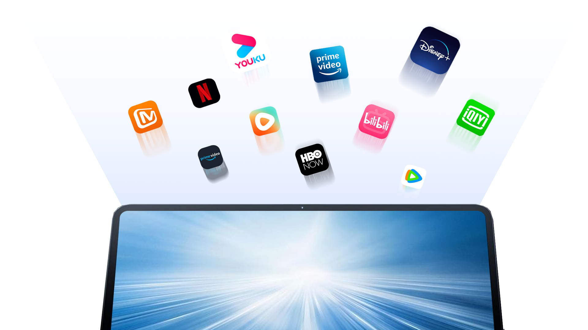
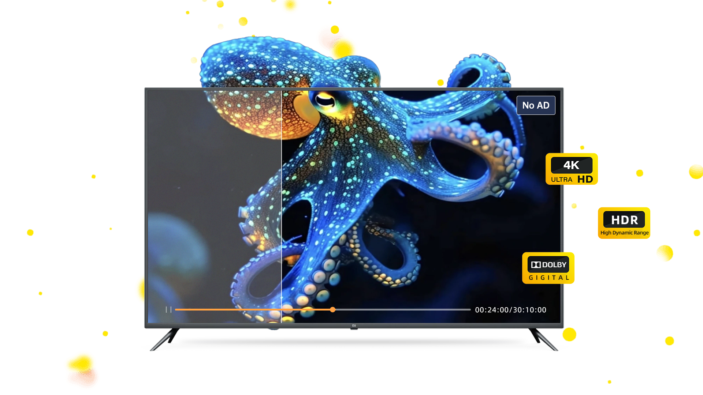
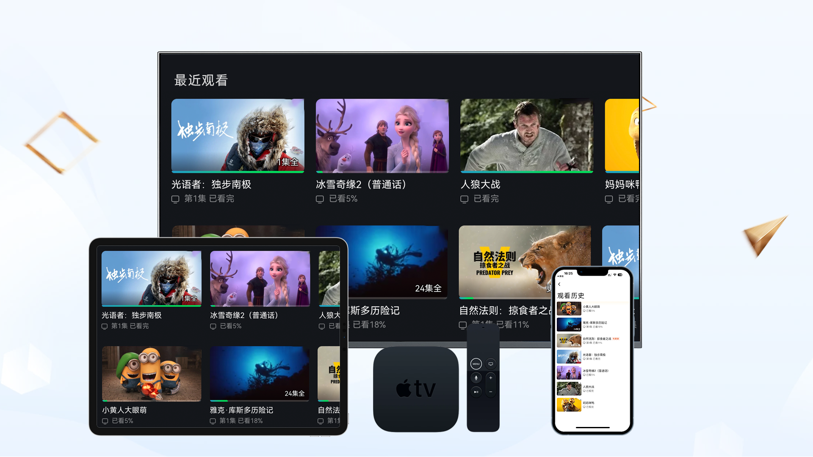

  <section class="home-adv">
    

      <h2 class="home-adv__title">包罗内外、一网打尽</h2>
      

        影视资源涵盖：Netflix、Amazon Prime Video、HBO、Disney+
      

      
腾讯视频、爱奇艺、优酷、红果短剧

      
从电视剧到电影，从综艺到短剧，无所不包

    

    

      
    

  </section>

  <section class="home-adv is-reverse">
    

      <h2 class="home-adv__title">无广告、极致画质</h2>
      
承诺绝不插入广告，清爽观影体验

      
所有资源优先 4K、HDR、杜比、蓝光高码，尊享视听盛宴

    

    

      
    

  </section>

  <section class="home-adv">
    

      <h2 class="home-adv__title">影库庞大、硬盘集群</h2>
      
PB+ 规模的资源量，你想看的，在这里都找得到

      

        自研架构的大规模本地硬盘集群，向网盘存储的缓慢体验说不
      

    

    

      
    

  </section>

  <section class="home-adv is-reverse">
    

      <h2 class="home-adv__title">全平台适用、播放记录同步</h2>
      

        无论你是手机还是电视、平板还是电脑，都有好用流畅的客户端使用
      

      
播放记录无缝同步，随时创建专属片单收藏

    

    

      
    

  </section>

